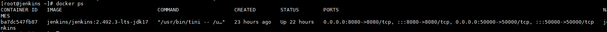
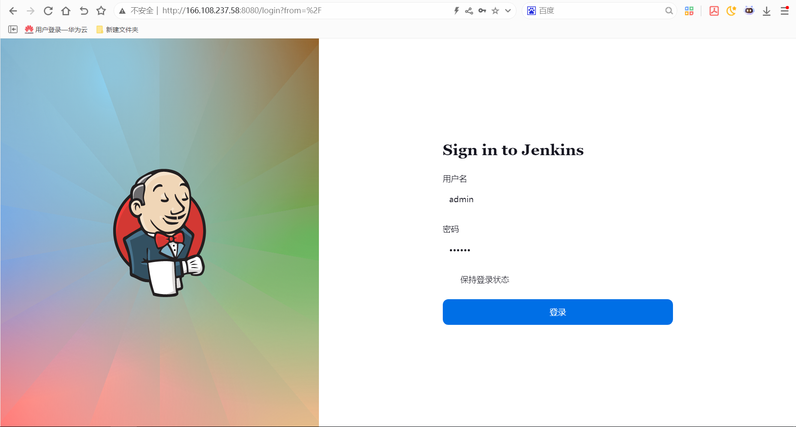
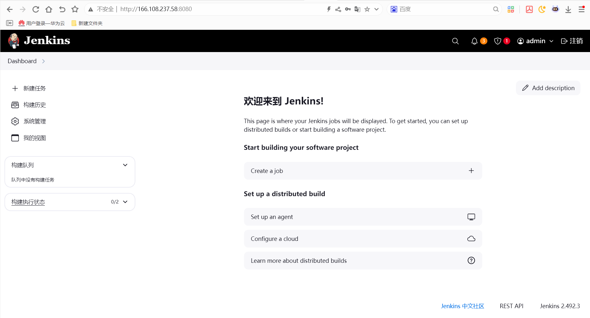

# jenkins持续集成工具使用指南

# 一、商品链接

[jenkins持续集成工具]()

# 二、商品说明

**Jenkins** 是一个开源软件项目，是基于Java开发的一种持续集成工具，用于监控持续重复的工作，旨在提供一个开放易用的软件平台，使软件项目可以进行持续集成。

# 三、商品购买

您可以在云商店搜索 **jenkins持续集成工具**。

其中，地域、规格、推荐配置使用默认，购买方式根据您的需求选择按需/按月/按年，短期使用推荐按需，长期使用推荐按月/按年，确认配置后点击“立即购买”。

- 购买参考：[镜像商品购买示例](./镜像商品购买示例.md)

> **值得注意的是ECS控制台自定义购买，安全组规则的配置如下：**
* 入方向规则放通端口:8080，源地址内必须包含您的客户端ip，否则无法访问
* 入方向规则放通 CloudShell 连接实例使用的端口 `22`，以便在控制台登录调试
* 出方向规则一键放通

# 商品使用

## 1.查看服务是否启动

```bash
docker ps
```


如果没有启动，可以手动启动，启动命令
```bash
docker start jenkins
```
## 2.IP+8080访问UI

默认用户名:admin,密码: 123456 进行登录


## jenkins集成华为云服务

本商品通过Jenkins插件机制，集成了华为云OBS和CodeArts部分能力，插件所有功能可参考：[jenkins华为云插件](https://gitee.com/HuaweiCloudDeveloper/huaweicloud-jenkins-plugins)
### 参考文档

[jenkins官方文档](https://www.jenkins.io/doc/)
