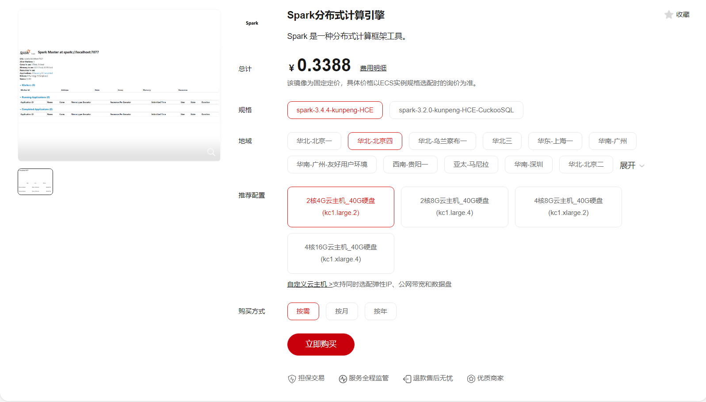
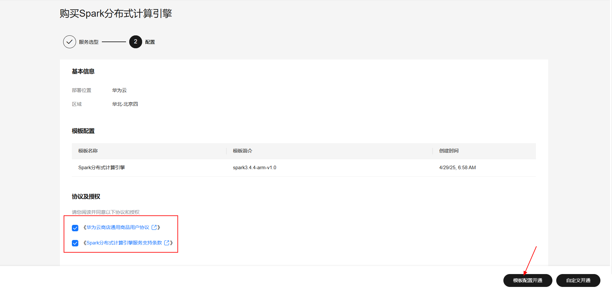
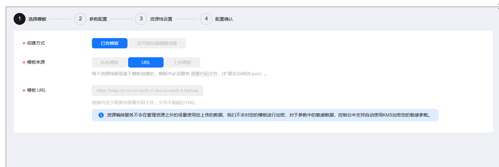

# 一、ECS控制台自定义购买

本文以在云商店购买Spark分布式计算引擎为例，描述商品购买的全流程

## 准备工作

在使用ECS控制台配置前，需要您提前配置好 **安全组规则**。

> **安全组规则的配置如下：**

* 入方向规则放通端口:8080(`根据实际情况开放软件需对外提供访问的端口，例如8080，3306等`)，源地址内必须包含您的客户端ip，否则无法访问
* 入方向规则放通 CloudShell 连接实例使用的端口 `22`，以便在控制台登录调试
* 出方向规则一键放通

## 创建ECS

前提工作准备好后，选择 ECS 控制台配置跳转到[购买ECS](https://support.huaweicloud.com/qs-ecs/ecs_01_0103.html) 页面，ECS 资源的配置如下图所示：

### 选择CPU架构和规格

1.根据镜像所适配的架构选择对应的架构
2.选择的规格要大于或等于说明文档中提供的最小规格

### 选择镜像

1.点击市场镜像，进入市场进行列表
2.选择需要购买的商品的规格镜像

### 其他参数配置

1.其他参数根据实际情况进行填写
2.安全组选择提前配置好的安全组
3.配置完成之后点击立即购买即可

**值得注意的是：**

* VPC 您可以自行创建
* 安全组选择 [**准备工作**](#准备工作)中配置的安全组；
* 弹性公网IP选择现在购买，推荐选择“按流量计费”，带宽大小可设置为5Mbit/s；
* 高级配置需要在高级选项支持注入自定义数据，所以登录凭证不能选择“密码”，选择创建后设置；
* 其余默认或按规则填写即可。

# 二、模板部署方式购买

## 购买商品

### 选择商品

1.在云商店通过商品名称搜索，“spark分布式计算引擎"，进入到商品页
1.选择好地域后，点击“立即购买”

### 选择开通方式
1.勾选协议
2.模板配置开通

第一步不需要做额外修改，直接下一步

### 参数配置

第二步进行参数配置，按需填写服务器规格参数后，点击下一步

第三步不需要做额外修改，直接下一步

第四步确认配置后，创建执行计划，点击 确定

创建完成之后点击部署，执行计划

如下图“Apply required resource success. ”即为资源创建完成

